<p align="center">
  
</p>

<p align="center">
  <strong>Final-year AI & Computer Science student at the University of Birmingham Dubai</strong><br />
  Building reliable backend systems, applied-AI products, and decision tools in the UAE.
</p>

<p align="center">
  <a href="https://www.linkedin.com/in/moustafa-ameen-817b81334"></a>
  <a href="https://mail.google.com/mail/?view=cm&amp;fs=1&amp;to=moustafa.ameen.useful%40gmail.com"></a>
  <a href="https://github.com/Moustafa-Ameen?tab=repositories"></a>
</p>

---

## What I build

I enjoy engineering products where **software, data, and real decisions meet**. My work spans secured Java services, Python machine-learning pipelines, full-stack TypeScript applications, deterministic optimization, data contracts, and AI systems with strict structured outputs.

The common thread is practical: understand the domain, make the recommendation explainable, protect the data boundary, and prove the system works with tests rather than hype.

- **Currently:** turning ambitious AI prototypes into reliable, decision-ready products.
- **Interested in:** backend engineering, applied AI/ML, fintech, data products, and technology delivery.
- **Based in:** Dubai, United Arab Emirates.

## Featured work

### [SquadMetric](https://github.com/Moustafa-Ameen/squadmetric)

**Recommendation-first Fantasy Premier League intelligence for the live 2026/27 season.**

Built a rules-versioned decision platform that combines multi-Gameweek projections, player availability, squad optimization, transfers, captaincy, chips, and historical simulation—then presents one primary recommendation with safe and aggressive alternatives.

<p>
  
  
  
  
  
</p>

- Point-in-time-safe modelling across multiple FPL rule eras.
- Deterministic planners for squad, bench, captain, transfer, and chip decisions.
- Immutable data snapshots, rules hashes, leakage safeguards, and persisted evidence.
- **304 Python tests, 32 frontend unit tests, and 32 desktop/mobile browser tests** at the latest verified baseline.

---

### [Friction](https://github.com/Moustafa-Ameen/friction)

**An AI decision workspace that turns messy conversations into ranked decisions, visible trade-offs, and a useful next question.**

Designed the product around the moment before a decision: users paste rough conversations or perspectives, and Friction extracts the real decision, scores what matters, compares options, classifies the tension, and creates a shareable brief.

<p>
  
  
  
  
  
</p>

- Strict model-output contracts validated with Zod.
- Server-side API-key boundary with safe local fallback analysis.
- Saved decisions, templates, journal notes, sharing, printing, and PDF briefs.
- Privacy-first local storage and resilient responsive workflows.

---

### [MandateIQ](https://github.com/Moustafa-Ameen/mandateiq)

**A secured wealth-management platform for advisor-led suitability, portfolio drift, transaction review, and rebalancing.**

<p>
  
  
  
  
</p>

- JWT authentication, advisor ownership checks, and protected REST APIs.
- PostgreSQL persistence, Flyway migrations, immutable transaction ledger, and audit logs.
- Risk scoring, suitability rules, allocation drift, and rebalancing recommendations.
- JUnit, security, and Testcontainers coverage with GitHub Actions CI.

---

### [Full-Stack Calorie Tracker](https://github.com/Moustafa-Ameen/full-stack-java-calorie-app)

**A responsive calorie and macronutrient tracker built from REST API to browser UI.**

<p>
  
  
  
  
</p>

- Food logging, custom foods, serving-size recalculation, and daily macro totals.
- TDEE calculation, user targets, responsive charts, and dynamic client-side state.
- Spring Data JPA, Spring Security/JWT structure, Docker, Render, and CI.

[Live demo](https://moustafa-calorie-tracker.onrender.com)

## Open-source engineering

I contribute to established Java projects and work through real maintainer feedback, repository conventions, regression tests, and CI—not isolated coding exercises.

| Contribution | Outcome |
| --- | --- |
| [Meilisearch Java SDK #985](https://github.com/meilisearch/meilisearch-java/pull/985) | **Merged.** Fixed Jackson serialization for granular filterable-attribute settings and added regression coverage for exact JSON round-tripping. |
| [DSpace #12788](https://github.com/DSpace/DSpace/pull/12788) | Open contribution correcting ORCID conference work-type mappings; unit, integration, Docker, CodeQL, and coverage checks pass. |
| [Meilisearch Java SDK #979](https://github.com/meilisearch/meilisearch-java/pull/979) | Open contribution adding stats size-format and internal database-size options to the Java SDK. |

## Experience beyond the repository list

### Technology Delivery Intern · ADNOC

Worked on Panorama 2.0 AI integration and built a privacy-safe local enterprise KPI dashboard with a Python server, metric drill-downs, charts, alerts, evidence lineage, data APIs, and print-ready reporting. The portfolio-safe edition deliberately uses synthetic data and keeps private operational sources outside Git.

### Business Consultant Intern · AperioHub

Worked across fintech market research, financial modelling, and GCC wealth-management strategy—experience that directly informed the domain thinking behind MandateIQ.

### Applied business and security learning

- **Deloitte Australia Data Analytics:** Tableau dashboarding, Excel classification, and forensic-technology analysis.
- **Mastercard Cybersecurity:** phishing-threat identification, security-awareness analysis, and targeted training recommendations.

## Engineering toolkit

<p align="center">
  
  
  
  
  
  
  
  
  
  
  
  
</p>

| Area | Tools and practices |
| --- | --- |
| **Backend** | Java, Spring Boot, Python, FastAPI, Express, REST APIs, validation, authentication |
| **Data & AI** | pandas, NumPy, scikit-learn, feature engineering, calibration, optimization, structured LLM output |
| **Frontend** | TypeScript, React, Next.js, Vite, JavaScript, Tailwind CSS, responsive and accessible UI |
| **Persistence** | PostgreSQL, Supabase, Row Level Security, Flyway, JPA, H2, immutable data snapshots |
| **Delivery** | Docker, Maven, GitHub Actions, Railway, Render, pytest, JUnit, Playwright, linting and CI |

## How I approach engineering

```text
Understand the decision → model the domain → protect the boundaries
→ test the failure modes → measure the outcome → communicate it clearly
```

- **Evidence over hype:** a model is useful only when it improves the real decision.
- **Security and privacy by design:** credentials stay server-side and sensitive data stays outside public repositories.
- **Production-minded prototypes:** authentication, migrations, CI, observability, fallbacks, and documentation matter.
- **Readable systems:** code, interfaces, and explanations should make trade-offs visible.

## GitHub snapshot

<p align="center">
  
</p>

---

<p align="center">
  <strong>Open to software engineering, backend, applied-AI, fintech, and technology-delivery opportunities.</strong><br /><br />
  <a href="https://mail.google.com/mail/?view=cm&amp;fs=1&amp;to=moustafa.ameen.useful%40gmail.com">moustafa.ameen.useful@gmail.com</a> ·
  <a href="https://www.linkedin.com/in/moustafa-ameen-817b81334">LinkedIn</a> ·
  <a href="https://github.com/Moustafa-Ameen?tab=repositories">Repositories</a>
</p>
